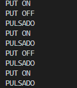

# PRACTICA 2 : INTERRUPCIONES
## Practica A interrupción por GPIO

### Codigo utilizado:
```cpp
#include <Arduino.h>

#define LED 16
unsigned long Mytime;
#define interruptpin 0
void  pin_interrupt();
void setup() {
  // put your setup code here, to run once:
Serial.begin(9600);
pinMode(LED,OUTPUT);
 attachInterrupt(digitalPinToInterrupt(interruptpin), pin_interrupt, FALLING);
}


void loop() {
  // put your main code here, to run repeatedly:
  Mytime=millis();
  while(millis()<Mytime+1000){}
  digitalWrite(LED,HIGH);
  Serial.println("PUT ON"); 
  Mytime=millis();
  while(millis()<Mytime+1000){}
  Serial.println("PUT OFF");
  digitalWrite(LED,LOW);
  
  
}

void pin_interrupt (){

Serial.println("PULSADO");

}
```

### Explicación del codigo:
Declaramos el pin de interrupción al pin 0 de la placa, que es el 'boot' y luego con el codigo utilizado, por pantalla se irá mostrando 'PUT ON' y 'PUT OFF' con un delay de 1000 ms mientras que no se detecte una interrupción al apretar el botón 'boot', al apretar este botón, por la pantalla se muestra 'PULSADO'.
En la parte física, se irá encendiendo y apagando el Led conectado el Pin 16 sincronamente con el texto de 'PUT ON' y 'PUT OFF'.

### Salidas por el puerto serie:
Por pantalla se muestra lo siguiente:

